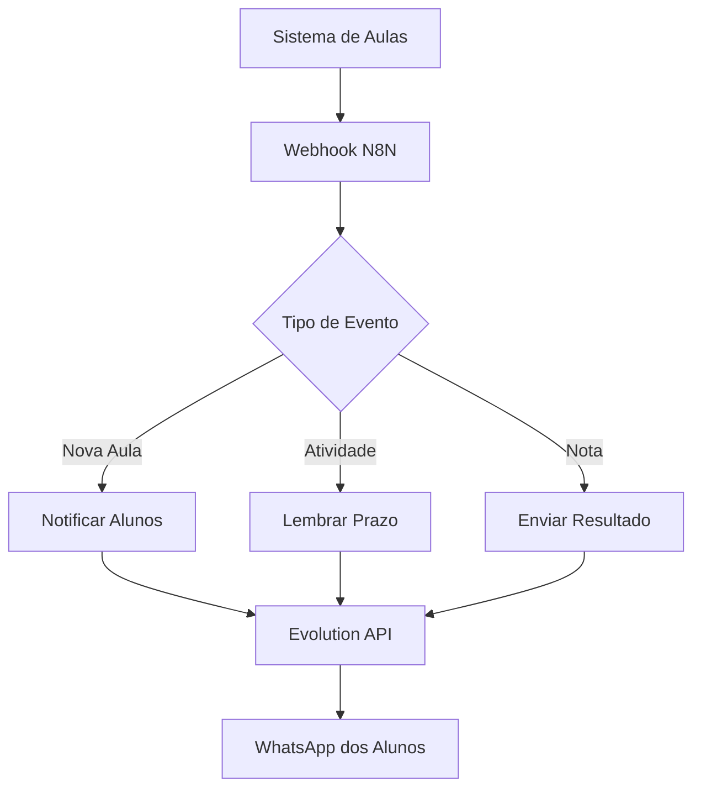

# 🚀 Exemplos Práticos - Projeto Ravenna

## 📋 Cenários de Uso Comuns

Este documento apresenta exemplos práticos de como usar o **Projeto Ravenna** em diferentes cenários reais.

## 🏢 Cenário 1: Empresa de Atendimento ao Cliente

### Situação
Uma empresa precisa de um sistema completo de atendimento com WhatsApp, automações e relatórios.

### Configuração Recomendada
```bash
# 1. Iniciar infraestrutura
docker-compose up -d postgres_db redis_cache minio_server

# 2. Configurar Chatwoot
docker-compose up -d chatwoot-rails chatwoot-sidekiq

# 3. Configurar Evolution API para WhatsApp
docker-compose up -d evolution_api

# 4. Configurar N8N para automações
docker-compose up -d n8n_editor n8n_webhook n8n_worker
```

### Fluxo de Trabalho
1. **WhatsApp** → Evolution API → **Chatwoot** (conversas)
2. **Chatwoot** → N8N → **Automações** (respostas automáticas)
3. **N8N** → **Relatórios** automáticos via e-mail

## 🏪 Cenário 2: E-commerce com Suporte

### Situação
Loja online que precisa integrar atendimento via WhatsApp com sistema de pedidos.

### Automação N8N Exemplo
```javascript
// Webhook que recebe dados do pedido
const pedido = $input.first().json;

// Envia mensagem via Evolution API
const mensagem = {
  "number": pedido.cliente_telefone,
  "text": `🛍️ Olá ${pedido.cliente_nome}!\n\nSeu pedido #${pedido.id} foi confirmado!\n\n📦 Itens: ${pedido.itens}\n💰 Total: R$ ${pedido.total}\n\n🚚 Previsão de entrega: ${pedido.prazo_entrega}`
};

return mensagem;
```

## 🏥 Cenário 3: Clínica Médica

### Situação
Clínica que precisa automatizar lembretes de consulta e confirmações.

### Configuração de Automação
```yaml
# Fluxo N8N para lembretes
Trigger: Cron (diário às 09:00)
↓
Database: Buscar consultas do dia seguinte
↓
Evolution API: Enviar lembrete via WhatsApp
↓
Chatwoot: Registrar interação
```

### Exemplo de Mensagem
```
🏥 Lembrete de Consulta

Olá, [NOME]!

📅 Você tem consulta marcada para AMANHÃ:
⏰ Horário: [HORA]
👨‍⚕️ Médico: Dr. [MEDICO]
📍 Local: [ENDERECO]

Para confirmar, responda:
✅ SIM - para confirmar
❌ NÃO - para remarcar

Clínica [NOME]
```

## 🎓 Cenário 4: Escola/Curso Online

### Situação
Instituição de ensino que precisa notificar alunos sobre aulas e atividades.

### Automação Completa


## 🛠️ Scripts Úteis

### 1. Backup Automático
```powershell
# Script para backup diário
$date = Get-Date -Format "yyyyMMdd"
$backupDir = "C:\Backups\Ravenna\$date"

# Criar diretório
New-Item -ItemType Directory -Path $backupDir -Force

# Backup dos volumes
docker run --rm -v postgres_data:/data -v $backupDir:/backup alpine tar czf /backup/postgres_$date.tar.gz -C /data .
docker run --rm -v chatwoot_data:/data -v $backupDir:/backup alpine tar czf /backup/chatwoot_$date.tar.gz -C /data .
docker run --rm -v n8n_data:/data -v $backupDir:/backup alpine tar czf /backup/n8n_$date.tar.gz -C /data .

Write-Host "✅ Backup concluído em: $backupDir"
```

### 2. Monitoramento de Saúde
```powershell
# Verifica se todos os serviços estão funcionando
$services = @("postgres_db", "redis_cache", "minio_server", "chatwoot-rails", "n8n_editor", "evolution_api")

foreach ($service in $services) {
    $status = docker ps --filter "name=$service" --format "table {{.Names}}\t{{.Status}}"
    if ($status -match "Up") {
        Write-Host "✅ $service: Online" -ForegroundColor Green
    } else {
        Write-Host "❌ $service: Offline" -ForegroundColor Red
    }
}
```

### 3. Limpeza de Logs
```powershell
# Remove logs antigos para economizar espaço
docker system prune -f
docker volume prune -f

# Limpar logs específicos (mais de 7 dias)
Get-ChildItem "C:\ProgramData\Docker\containers\*\*.log" | Where-Object {$_.LastWriteTime -lt (Get-Date).AddDays(-7)} | Remove-Item -Force

Write-Host "🧹 Limpeza concluída!"
```

## 📊 Exemplos de Relatórios N8N

### 1. Relatório Diário de Atendimentos
```javascript
// Node N8N para gerar relatório
const hoje = new Date().toISOString().split('T')[0];

// Buscar dados do Chatwoot
const conversas = await $http.request({
  method: 'GET',
  url: 'http://chatwoot-rails:3000/api/v1/accounts/1/conversations',
  headers: {
    'api_access_token': 'sua_api_key_aqui'
  }
});

// Processar dados
const relatorio = {
  data: hoje,
  total_conversas: conversas.length,
  conversas_abertas: conversas.filter(c => c.status === 'open').length,
  conversas_resolvidas: conversas.filter(c => c.status === 'resolved').length
};

return relatorio;
```

### 2. Integração com Google Sheets
```javascript
// Enviar dados para planilha
const dados = [
  [new Date().toLocaleDateString(), 
   $json.total_conversas, 
   $json.conversas_abertas, 
   $json.conversas_resolvidas]
];

return {
  range: 'A:D',
  values: dados
};
```

## 🔧 Troubleshooting Prático

### Problema: Evolution API não conecta WhatsApp
```bash
# 1. Verificar logs
docker logs evolution_api -f

# 2. Reiniciar serviço
docker-compose restart evolution_api

# 3. Verificar QR Code
curl http://localhost:8080/instance/qrcode?instanceName=default
```

### Problema: N8N workflows não executam
```bash
# 1. Verificar worker
docker logs n8n_worker -f

# 2. Verificar Redis
docker exec redis_cache redis-cli ping

# 3. Reiniciar serviços N8N
docker-compose restart n8n_editor n8n_webhook n8n_worker
```

## 📱 Exemplos de Integração Mobile

### Webhook para App Mobile
```javascript
// Receber notificação do app e enviar via WhatsApp
const notification = $input.first().json;

const message = {
  number: notification.user_phone,
  text: `📱 ${notification.title}\n\n${notification.message}`
};

// Enviar via Evolution API
return message;
```

## 🎯 Próximos Passos

Após implementar estes exemplos:

1. **Monitore** os logs regularmente
2. **Teste** as automações em ambiente controlado
3. **Documente** suas customizações
4. **Faça backup** antes de mudanças importantes
5. **Mantenha** as versões atualizadas

---

💡 **Dica**: Comece com um cenário simples e vá expandindo gradualmente conforme sua necessidade!